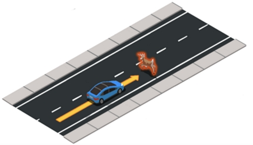
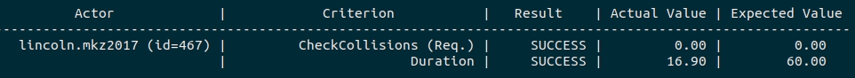

# First steps

This page contains a brief introduction to the core concepts in ScenarioRunner and some brief tutorials on how to get started with these.

*   [__Scenarios and agents__](#scenarios-and-agents)
	*   [Scenario files](#component-files)  
*   [__Run scenarios__](#run-scenarios)
	*   [Example scenarios](#example-scenarios)  
	*   [Custom scenarios](#custom-scenarios)  
	*   [Types of scenarios](#types-of-scenarios)  
	*   [OpenSCENARIO scenarios](#openscenario-scenarios)  
*   [__Routes__](#routes)
	*   [Run a route-based scenario](#run-a-route-based-scenario)  
*   [Analyze and debug scenarios](#analyze-and-debug-scenarios)  
	*   [Additional metrics](#additional-metrics)  

!!! Important
    This page refers to CARLA 0.9.5 or later versions.

---
## Scenarios and agents

__Scenarios__ are choreographies of actors that result in specific traffic situations. These scenarios are focused around one or more agents. __Agents__ are actors which implement and AD stack and are meant to react to their surroundings. A scenario will set up actors and environmental conditions to recreate a specific situation, and the agent will have to react using the behaviour implemented by the user. 
In ScenarioRunner and CARLA the vehicles representing agents are called __ego vehicles__.  

The following image represents a scenario with two actors: a deer, crossing the road, and the blue vehicle, forced to brake to not collide with it.  

*   __Agent:__ The blue vehicle. The should provide with the desired behaviour implementation to react to the scenario.
*   __Scenario:__ The set up of the deer to cross the road near the agent, to force a specific situation. In this case, an unexpected obstacle that forces the agent to break or manouver.  
<div style="text-align: right">
<br>
<i>Scenario: Avoid unexpected obstacle</i></div>

ScenarioRunner comes with some example scenarios that can be used to train agents or create new scenario. [Here](list_of_scenarios.md) is a reference of the scenarios provided. Visit [this tutorial](list_of_scenarios.md) to learn how to create new scenarios. 

!!! Important
    The scenarios are configured for specific CARLA towns. The town loaded in the CARLA server should match one that appears in the configuration file of said scenario. Alternatively, use the flag `--reloadWorld` to change the map automatically. 


### Scenario files

A specific scenario belongs to a certain __type__, which is described by a Python file and named with the generic casuistic it represents. For example, *FollowLeadingVehicle* is a scenario type, and *FollowLeadingVehicle_1* is the name given to a definition of said scenario, with settings that appear in the __configuration file__. 

---
## Run scenarios

### Example scenarios

To run one of the preexisting scenarios, only a name is needed, which is given via the `--scenario` argument. 

```sh
python3 scenario_runner.py --scenario <ScenarioName>
```

In order to check all the possible scenario names, use:
```sh
python3 scenario_runner.py --list
```
  <details>
    <summary>Example output</summary>

```sh
Currently the following scenarios are supported:
ControlLoss_1
ControlLoss_2
ControlLoss_3
SignalizedJunctionLeftTurn_1
SignalizedJunctionLeftTurn_2
SignalizedJunctionLeftTurn_3
SignalizedJunctionLeftTurn_4
VehicleTurningRight_1
VehicleTurningLeft_1
VehicleTurningRight_2
VehicleTurningLeft_2
CARLA:LaneChangeSimple (OpenSCENARIO)
CARLA:CyclistCrossing (OpenSCENARIO)
```
  </details>
<br>

Once the scenario is set-up, an ego vehicle will be needed to activate it. The manual control script provided can be used to do so. Let's run an example scenario.  

__1. Run a CARLA server:__ This should be done always. ScenarioRunner runs based on a CARLA server.  

__2. Run the scenario:__ For the sake of this tutorial, `OppositeVehicleRunnignRedLight011` is chosen. 

```sh
# The flag --reloadWorld changes the map automatically to one where the scenario is available.
python3 scenario_runner.py --scenario OppositeVehicleRunningRedLight_1 --reloadWorld
```
!!! Important
    Run either `python` or `python3` depending on the Python version being used.

__2. Run the agent:__ For example, the manual control script in ScenarioRunner.

```sh
python3 manual_control.py
```

!!! Warning
    Do __not__ use the `manual_control.py` in CARLA. 

### Run a custom scenario

If additional scenarios have been created, or the examples have been customized, two more arguments are needed. 

*   __`--additionalScenario`__ — Path to a `.py` file with the scenario definition.  
*   __`--configFile`__ — Path to a `.xml` file with the configuration file. Links the name of the scenario with the path to the type of scenario, and allows for some additional parameters.  

```sh
python scenario_runner.py --scenario <ScenarioName> --additionalScenario <scenario_file> --configFile <config_file>
```

Here are some customizable parameters that can be defined in the configuration file. 

*   __`town`__ — map where the scenario happens.  
*   __Actor parameters__ — Change the location of the scenario by moving the actors, and customize other parameters for these.  
	*   __`x`__, __`y`__, __`z`__  —  location of the actor.  
	*   __`yaw`__, __`pitch`__, __`roll`__  —  rotation of the actor.  
	*   __`model`__  —  blueprint of the actor.  
	*   __`rolename`__  —  Identify the actor with a specific tag.  
	*   __`autopilot`__  — Enables the autopilot for a vehicle.  
	*   __`random_location`__  —  If the map has spawning points defined, spawns the actor in one of these at random.  
*   __Weather parameters__ — Change the ambience and conditions of the scene. These parameters are the same that appear in [carla.WeatherParameters](https://carla.readthedocs.io/en/latest/python_api/#carlaweatherparameters). 
	*   __`cloudiness`__  —  0 is a clear sky, 100 complete overcast.  
	*   __`precipitation`__  —   0 is no rain at all, 100 a heavy rain.  
	*   __`precipitation_deposits`__  —  means no puddles on the road, 100 means roads completely capped by rain.   
	*   __`wind_intensity`__  —  0 is calm, 100 a strong wind.  
	*   __`fog_density`__  —  0 is an arbitrary North, 180 its corresponding South.  
	*   __`fog_distance`__  —  90 is midday, -90 is midnight.  
	*   __`wetness`__  —  location of the actor.  
	*   __`sun_azimuth_angle`__  —  Density of the fog, from 0 to 100.  
	*   __`sun_altitude_angle`__  —  Distance where the fog starts in meters.  
	*   __`falloff`__  —  Density (specific mass) of the fog, from 0 to infinity.  

The following code describes part of an `.xml` file with three scenarios, that will be used as configuration file. They all have the same type, which refers to class name at the scenario file. The town and location of the actors is changed, creating three different settings for the same scenario definition.  
```xml
<scenario name="OppositeVehicleRunningRedLight011" type="OppositeVehicleRunningRedLight" town="Town01">
   <ego_vehicle x="126.4" y="55.2" z="1" yaw="180" model="vehicle.lincoln.mkz2017" />
   <other_actor x="93" y="81" z="1" yaw="270" model="vehicle.tesla.model3" />
</scenario>
<scenario name="OppositeVehicleRunningRedLight021" type="OppositeVehicleRunningRedLight" town="Town02">
   <ego_vehicle x="-3" y="250" z="1" yaw="270" model="vehicle.lincoln.mkz2017" />
   <other_actor x="8.5" y="188" z="0.3" yaw="180" model="vehicle.tesla.model3" />
</scenario>
<scenario name="OppositeVehicleRunningRedLight031" type="OppositeVehicleRunningRedLight" town="Town03">
   <ego_vehicle x="-2.8" y="-184" z="1" yaw="90" model="vehicle.lincoln.mkz2017" />
   <other_actor x="-22.5" y="-135" z="0.1" yaw="0" model="vehicle.tesla.model3" />
</scenario>
```

The following code contains another fragment of the configuration file, with a scenario definition where the weather conditions are set by the user.  

```xml
<scenario name="FollowLeadingVehicle_1" type="FollowLeadingVehicle" town="Town01">
   <ego_vehicle x="107" y="133" z="0.5" yaw="0" model="vehicle.lincoln.mkz2017" />
   <weather cloudiness="0" precipitation="0" precipitation_deposits="0" wind_intensity="0" sun_azimuth_angle="0" sun_altitude_angle="75" />
</scenario>
```

### Types of scenarios

All the scenarios of a certain type (based on the same python file) can be run in sequence.  

Use the same argument `--scenario` as for simple scenarios, with the addition of the flag: `group:<type_name>`. The following example runs all the scenarios of type `FollowLeadingVehicle` that can be found in ???. 

--> How does this know which configuration file you want to use? 

```sh
python scenario_runner.py --scenario group:FollowLeadingVehicle --reloadWorld
```

!!! Warning
    If `--reloadWorld` is not used, only the scenarios described for the current map will be loaded. This parameter allows changing the map between scenarios.  


> Tienes qeu ejecutar el agente a cada cambio de escenario. 
> ¿Configuration file srunner/examples? ¿Le puedes pasar una en concreto? 
> ¿Automatizar el lanzamiento del agente? 

### OpenSCENARIO scenarios

To run a scenario based on the OpenSCENARIO format, use the optional argument `--openscenario` and the path to the `.xosc` file. 

```sh
python scenario_runner.py --openscenario <'path/to/xosc-file'>
```

The OpenSCENARIO support and the OpenSCENARIO format itself are still work in progress. More information about which features are supported in ScenarioRunner can be found [here](openscenario_support.md)

---
## Routes

Routes are paths that connect a sequence scenarios in the same town. This allow the user to run multiple scenarios using the same agents and simulations. The scenarios will be triggered when the ego vehicle is nearby the location specified for the scenario.  

> 

Routes also include background activity, such as vehicles or walkers that wander around and bring the map to life, for a more realistic simulation. 

> How to add background activity


> Mention to leaderboard being a route? 

### Run a route-based scenario

To run these, we use the --route argument, which has three elements.

The first one is the information about the route itself. This route is created as a list of waypoint elements, that will be transformed to a carla.Waypoint and therefore need its location and rotation defined. ScenarioRunner has a tool that automatically creates waypoints every meter, so only the important waypoints should be added at the configuration file. This file also has global parameters such as the town, weather, or id. 

The second argument is a .json file with the parameters of the scenarios present at the route. This serves the same purpose as the previous .xml configuration file when running isolated scenarios. This change to a .json has been to allow the scenarios to be transformed into a dictionary, as now they all have to be scanned as more than one scenario can be run per route. It is important to note that not all the scenarios here will be run. ScenarioRunner automatically filters those that aren’t part of the route and if more than one scenario is at the same location, chooses one at random.

The third argument is just the route name, and serves as the --scenario argument of the previous example. If left empty, all routes will be run.

Lastly, routes need an agent to pass the route to. This has to be given via the --agent argument. An explanation of how to create agents is done at the end of the presentation.

```xml
<route id="2" map="Town01">
  <waypoint pitch="0.0" roll="0.0" x="53.05508041381836" y="-2.35788631439209" yaw="-179.970947265625" z="0.0" />
  <waypoint pitch="0.0" roll="0.0" x="-2.673415422439575" y="28.63454818725586" yaw="89.88465118408203" z="0.0" />
  <waypoint pitch="0.0" roll="0.0" x="-2.3427786827087402" y="192.8701171875" yaw="89.88465118408203" z="0.0" />
  <waypoint pitch="0.0" roll="0.0" x="-2.1942241191864014" y="266.6610107421875" yaw="89.88465118408203" z="0.0" />
  <waypoint pitch="0.0" roll="0.0" x="-2.1050660610198975" y="310.9482727050781" yaw="89.88465118408203" z="0.0" />
  <waypoint pitch="0.0" roll="0.0" x="24.25780487060547" y="330.2689208984375" yaw="0.03519752621650696" z="0.0" />
  <waypoint pitch="0.0" roll="0.0" x="67.7093276977539" y="330.29559326171875" yaw="0.03519752621650696" z="0.0" />
  <waypoint pitch="0.0" roll="0.0" x="103.49156951904297" y="330.31756591796875" yaw="0.035137325525283813" z="0.0" />
  <waypoint pitch="0.0" roll="0.0" x="271.3299560546875" y="330.4205017089844" yaw="0.035137325525283813" z="0.0" />
  <waypoint pitch="0.0" roll="0.0" x="316.4518127441406" y="330.4482421875" yaw="0.03531792759895325" z="0.0" />
  <waypoint pitch="0.0" roll="0.0" x="376.9873352050781" y="330.485595703125" yaw="0.03531792759895325" z="0.0" />
  <waypoint pitch="0.0" roll="0.0" x="396.4393310546875" y="290.8396301269531" yaw="-90.04281616210938" z="0.0" />
  <waypoint pitch="0.0" roll="0.0" x="396.38623046875" y="219.68142700195312" yaw="-90.04266357421875" z="0.0" />
  <waypoint pitch="0.0" roll="0.0" x="396.3192443847656" y="129.7147979736328" yaw="-90.04266357421875" z="0.0" />
</route>
```

Here we can see an example of a route at Town01. Check srunner/scenarios/route_scenario.py to check how these routes are created.

First of all, the debug flag has been activated. With this flag, we can see the waypoints that conform the route. The colors represent the different RoadOption values, which is given as part of the route to the agent. They follow the following color codes:
LANEFOLLOW: green
RIGHT: cyan
LEFT: yellow
STRAIGHT: gray
CHANGELANELEFT: orange
CHANGELANERIGHT: dark cyan

In red, we can see the trigger positions of the scenarios. Take a look at the vehicle in the right, the ego vehicle. When it passes near that position, the scenario is activated. In the case of this one, a bicycle is created at the end of the intersection, ready to cross at the worst possible moment. Luckily, the ego vehicles stops in time, and the bicycle passes safely. Right at the end of the intersection we also have another behavior of similar nature.

In this case, one scenario is activated after the other, but this doesn’t have to be the case. More than one scenario can be active at the same. 

To run a route-based scenario, please run the ScenarioRunner as follows:

```sh
python scenario_runner.py --route <'path/to/route-file'> <'path/to/scenario_sample_file'> <route_id> --agent <'path/to/agent_file'>
# <route_id> or [route_id]
```

For example:
```sh
python scenario_runner.py /scenario_runner/srunner/routes_debug.xml /scenario_runner/srunner/data/all_towns_traffic_scenarios1_3_4.json 0 --agent srunner/autoagents/npc_agent.py
```
> Not working: 
```
ImportError: /home/adas/.cache/Python-Eggs/carla-0.9.9-py3.6-linux-x86_64.egg-tmp/carla/libcarla.cpython-36m-x86_64-linux-gnu.so: undefined symbol: PyUnicode_AsUTF8String
```

If no route id is provided, all routes within the given file will be executed.

> Difference then with non-route scenarios? 


By doing so, ScenarioRunner will match the scenarios to the route, and they'll activate when the ego vehicle is nearby. However, routes need an autonomous agent to control the ego vehicle. Several examples are provided in srunner/autoagents/. For more information about agents, please have a look into the [agent documentation](agent_evaluation.md)


---
## Analyze and debug scenarios

The scenarios can be analyzed with the help of some criterias, such as number of collisions, and passing/failing conditions can be stated. This information can be printed through terminal with the `--output` argument, creating a table with the result of all the criterias defined. This same table can be written into a file with `--file` argument. The `--junit` argument transforms this information into a junit-formatted XML that can be read by Jenkins to  evaluate the success of the scenario.

There is also a debug command `--debug` which allows to print in real time information about the execution of the scenario.


<div style="text-align: right"><i>Debug commandline output</i></div>

### Evaluation metrics

Lastly, we can add more criterias that aren’t related to the execution of any scenario, but to the behavior of the ego vehicle in general. These criterias are defined at MasterScenario (srunner/scenarios/master_scenario.py) and by default, the following criterias are used:  

*   __`CollisionTest`__ — Checks the collisions between a specific actor and all the other elements in the scene. 
*   __`InRouteTest`__ *(Needs a route as input)* — Triggers when the vehicle has deviated from the route. If this criteria fails, the simulation is stopped.
*   __`RouteCompletionTest`__ *(Needs a route as input)* — Tracks the position of the ego vehicle with respect to the route. This criteria is the one that stops the simulation when the ego vehicle completes it.
*   __`OutsideRouteLanesTest`__ *(Needs a route as input)* — Used to know if the ego vehicle has invaded either the sidewalk or lanes of the opposite direction. This is given as a percentage of the route completed. 
*   __`RunningRedLightTest`__ — Counts the number of red lights run
*   __`RunningStopTest`__ — Counts the number of stop signs ignored. 
*   __`ActorSpeedAboveThresholdTest`__ — Similar to InRouteTest, this criteria is used to stop the simulation if the ego vehicle hasn’t moved for more than 90 seconds.

With the help of some metrics, we can measure these criterias and create an overall score for the agent. This has been put together in the Leaderboard (https://leaderboard.carla.org/
), an online web service to evaluate AD stacks.

---
That is a wrap on the CARLA basics. The next step takes a closer look to the world and the clients connecting to it.  

Keep reading to learn more. Visit the forum to post any doubts or suggestions that have come to mind during this reading.  

<div text-align: center>
<div class="build-buttons">
<p>
<a href="https://forum.carla.org/c/using-carla/scenario-runner" target="_blank" class="btn btn-neutral" title="CARLA forum">
CARLA forum</a>
</p>
</div>
</div>