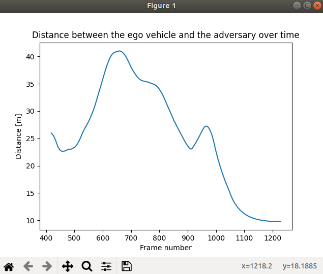

# Metrics module

In this section, an introduction will be made to the metrics module of ScenarioRunner, explaining what it is and how to use it, as well as some examples and a step by step creation of a new metric.

## What is the metrics module

The metrics module gives to the user access to all the information of the simulation, allowing the easy calculus and monitor of any kind of parameter. All of this is done post simulation and is separate from the *scenario_runner.py* script, to allow the creation and modification of multiple metrics without having to resimulate up to hours and hours of simulation. This module uses the CARLA recorder to store the scenario's information, as well as the scenario's criteria, in case the user also wants to check their results.

## Using the module

To use the module, run *metrics_manager.py*. This is the main script of the module, and eveything is ejecuted from there, similar to how *scenario_runner.py* works. The script has the usual *host* and *port* arguments, as well as three others, which englobe the information of the simulation, as well as the metric that its gonna be used:

*   __metrics__: This is the path to the metric to be used
*   __log__: Path (relative to SCENARIO_RUNNER_ROOT) to a *.log* file. This file is the output of the CARLA recorder of a specific scenario.
*   __criteria__ (optional): Path to a *.json* file with the criteria of the scenario


### Saving the data from a scenario

From the previous section, it can be seen that the module needs a couple of predefined scripts (the log and criteria files) in order to be properly executed. In order to do so, the *record* argument has to be used, which accepts a paths relative to SCENARIO_RUNNER_ROOT:

   ```
   python scenario_runner.py --scenario <scenario_name> --record <path/to/save/the/recorder/file>
   ```

This will do two things. Firstly, the recorder will be activated, saving all the information of the simulation into a *.log* file. It is this file that has to be given to the *metrics_manager.py*. Secondly, all the criteria will be parsed into a readable *.json* file, transforming them into a dictionary. The keys of the dictionary are the names of the criteria, and the values, a list of the criterion attributes. Again, input this file to the *metrics_manager.py*  if the metric needs some of the criteria information.

!!! Note
    Only the json serializable attributes will be parsed, the rest will be ignored.

By default, the name of these two files is dependent on the name of the scenario. For example, if the scenario name is *VehicleTurningLeft_1*, the recorder file will have its same name, *VehicleTurningLeft_1.log*, and the criteria file, *VehicleTurningLeft_1.json*.

### Structure of the module

All of the files that are part of this module are located inside the *srunner/metrics* folder. These folder has been divided in three subfolders.

The first fodler, *data*,  is meant to provide a place to store the information about the scenarios. By default, it has six files, which are part of the examples metric.

These example metrics can be found at the *examples* folder, which also includes *basic_metric.py*, with the BasicMetric class. Similarly to the BasicScenario class at *srunner/scenarios/basic_scenario.py*, all metrics have to inherit from BasicMetric in order to properly work. The three example metrics are:

*   __distance_to_lane_center.py__: This metric calculates the distance between the vehicle location and the center of the lane. Used to show how to access the map API information.
*   __distance_betwen_vehicles.py__: Used to show how to access the recorder, this metric gets the distance between two vehicles.
*   __criteria_filter__: returns a json with the most important attributes of the criteria.

The third and final folder, *tools*, englobes two key scripts that allows easy access to the information of the recorder. The first one, *metrics_parser.py*, transforms the string given by the recorder to a dictionary, and *metrics_log.py*, has several functions to access this dictionary. It is important to be familiriazed with the functions at this file, as it is the easiest way to access the scenario's information.

### Running and analyzing an example metric

The next step to understand this module is to run an example. In this case, let's run *distance_betwen_vehicles.py*. To do so, run:

   ```
   python metrics_manager.py --metric srunner/metrics/examples/distance_between_vehicles.py --log srunner/metrics/data/DistanceBetweenVehicles.log
   ```

!!! Note
    The simulation must be running, or the module won't be able to acces the map API and fail.

This will create a new window with the results plotted. The script won't finish until this window is closed.



Let's dig a little bit into the code itself to show how to use the log class:

    ```
    class DistanceBetweenVehicles(BasicMetric):
    """
    Metric class DistanceBetweenVehicles
    """

    def _create_metric(self, town_map, log, criteria):
        """
        Implementation of the metric. This is an example to show how to use the recorder,
        accessed via the log.
        """

        # Get the ID of the two vehicles
        ego_id = log.get_ego_vehicle_id()
        adv_id = log.get_actor_ids_with_role_name("scenario")[0]  # Could have also used its type_id

        dist_list = []
        frames_list = []

        # Get the frames both actors were alive
        start_ego, end_ego = log.get_actor_alive_frames(ego_id)
        start_adv, end_adv = log.get_actor_alive_frames(adv_id)
        start = max(start_ego, start_adv)
        end = min(end_ego, end_adv)

        # Get the distance between the two
        for i in range(start, end):

            # Get the transforms
            ego_location = log.get_actor_transform(ego_id, i).location
            adv_location = log.get_actor_transform(adv_id, i).location

            # Filter some points for a better graph
            if adv_location.z < -10:
                continue

            dist_v = ego_location - adv_location
            dist = math.sqrt(dist_v.x * dist_v.x + dist_v.y * dist_v.y + dist_v.z * dist_v.z)

            dist_list.append(dist)
            frames_list.append(i)

        # Use matplotlib to show the results
        plt.plot(frames_list, dist_list)
        plt.ylabel('Distance [m]')
        plt.xlabel('Frame number')
        plt.title('Distance between the ego vehicle and the adversary over time')
        plt.show()
    ```

As previously explained, all metrics are childs of *BasicMetric*, and this one is no exception. The only required function for the metric to work is *_create_metric()*, which has three arguments:

*   __town_map__: a *carla.Map()* instance of the town the scenario took place in
*   __log__: instance to the MetricsLog class, with all the functions needed to access the recorder dictionary.
*   __criteria__: a json with the criteria dictionary given through the *metrics_manager*.

This class is an example of a possible metric related to the *FollowLeadingVehicle* scenario and, as the name of the class implies, calculates the distance between the ego vehicle, and the car being followed.

To do so, the first thing that's needed are the id's of the two vehicles. This can be done by the log functions *get_ego_vehicle_id()* and *get_actor_ids_with_role_name("scenario")[0]*. With their ids, the frames where they were both alive can be gotten, using *get_actor_alive_frames(actor_id)*. Now everything is ready to loop through those frames, get their transforms and calculate the distance. To get the transform, *get_actor_transform(actor_id, frame)* is used. As a quick note, the vertical condition of the adversary is to only take into account the moments where the adversary was driving normally.

Lastly, we just plot the results, which creates the window previously shown.

### Accessing the recorder

From the example, it can be seen that all the information about the scenario is accessed via the MetricsLog class (the *log* argument at the *create_metric()* function). As a reminder, this class is located at *srunner/metrics/tools/metrics_log.py*, and has the following functions:

#### General information of the simulation:

- <a name="get_collisions"></a>**<font color="#7fb800">get_collisions</font>**(<font color="#00a6ed">**self**</font>,<font color="#00a6ed">**actor_id**</font>)  
Returns a list of dictionaries with two keys, *frame*, the frame number of the collision, and *other_id*, a list of the ids the actor collided with at that frame.
    - **Return:** list
    - **Parameters:**
        - `actor_id` (_int_): ID of the actor.

- <a name="get_total_frame_count"></a>**<font color="#7fb800">get_total_frame_count</font>**(<font color="#00a6ed">**self**</font>)  
Returns an int with the total amount of frames the simulation lasted.
    - **Return:** int

- <a name="get_elapsed_time"></a>**<font color="#7fb800">get_elapsed_time</font>**(<font color="#00a6ed">**self**</font>, <font color="#00a6ed">**frame**</font>)  
Returns a float with the elapsed time of a specific frame.
    - **Return:** float
    - **Parameters:**
        - `frame` (_int_): frame number.

- <a name="get_delta_time"></a>**<font color="#7fb800">get_delta_time</font>**(<font color="#00a6ed">**self**</font>, <font color="#00a6ed">**frame**</font>)  
Returns an float with the delta time of a specific frame.
    - **Return:** float
    - **Parameters:**
        - `frame` (_int_): frame number.

- <a name="get_platform_time"></a>**<font color="#7fb800">get_platform_time</font>**(<font color="#00a6ed">**self**</font>, <font color="#00a6ed">**frame**</font>)  
Returns a float with the platform time of a specific frame.
    - **Return:** float
    - **Parameters:**
        - `frame` (_int_): frame number.

#### Information about the actors:

- <a name="get_ego_vehicle_id"></a>**<font color="#7fb800">get_ego_vehicle_id</font>**(<font color="#00a6ed">**self**</font>)  
Returns the id of the ego vehicle.
    - **Return:** int

- <a name="get_actor_ids_with_role_name"></a>**<font color="#7fb800">get_actor_ids_with_role_name</font>**(<font color="#00a6ed">**self**</font>, <font color="#00a6ed">**role_name**</font>)  
Returns a list of actor ids that match the given role_name.
    - **Return:** list
    - **Parameters:**
        - `role_name` (_str_): role_name attribute.

- <a name="get_actor_ids_with_type_id"></a>**<font color="#7fb800">get_actor_ids_with_type_id</font>**(<font color="#00a6ed">**self**</font>, <font color="#00a6ed">**type_id**</font>)  
Returns a list of actor ids that match the given type_id, matching fnmatch standard.
    - **Return:** list
    - **Parameters:**
        - `type_id` (_str_): type_id attribute.

- <a name="get_actor_attributes"></a>**<font color="#7fb800">get_actor_attributes</font>**(<font color="#00a6ed">**self**</font>, <font color="#00a6ed">**actor_id**</font>)  
Returns a dictionary with all the attributes of an actor.
    - **Return:** dict
    - **Parameters:**
        - `actor_id` (_int_): ID of the actor.

- <a name="get_actor_bounding_box"></a>**<font color="#7fb800">get_actor_bounding_box</font>**(<font color="#00a6ed">**self**</font>, <font color="#00a6ed">**actor_id**</font>)  
Returns the bounding box of the specified actor
    - **Return:** carla.BoundingBox
    - **Parameters:**
        - `actor_id` (_int_): ID of the actor.

- <a name="get_traffic_light_trigger_volume"></a>**<font color="#7fb800">get_traffic_light_trigger_volume</font>**(<font color="#00a6ed">**self**</font>, <font color="#00a6ed">**traffic_light_id**</font>)  
Returns the trigger volume of the specified traffic light
    - **Return:** carla.BoundingBox
    - **Parameters:**
        - `traffic_light_id` (_int_): ID of the traffic light.

- <a name="get_actor_alive_frames"></a>**<font color="#7fb800">get_actor_alive_frames</font>**(<font color="#00a6ed">**self**</font>, <font color="#00a6ed">**actor_id**</font>)  
Returns a tuple with the first and last frame an actor was alive. Note that that frames start at 1, not 0.
    - **Return:** tuple
    - **Parameters:**
        - `actor_id` (_int_): ID of the actor.

#### Actor transform:

- <a name="get_actor_transform"></a>**<font color="#7fb800">get_actor_transform</font>**(<font color="#00a6ed">**self**</font>, <font color="#00a6ed">**actor_id**</font>, <font color="#00a6ed">**frame**</font>)  
Returns the transform of the actor at a given frame. Returns <b>None</b> if the actor id doesn't exist, the actor has no transform, or the actor wasn't alive at that frame.
    - **Return:** carla.Transform
    - **Parameters:**
        - `actor_id` (_int_): ID of the actor.
        - `frame` (_int_): frame number.

- <a name="get_all_actor_transforms"></a>**<font color="#7fb800">get_all_actor_transforms</font>**(<font color="#00a6ed">**self**</font>, <font color="#00a6ed">**actor_id**</font>, <font color="#00a6ed">**first_frame**=None</font>, <font color="#00a6ed">**last_frame**=None</font>)  
Returns a list with all the transforms of the actor at the frame interval. By default, this frame interval is all the frames of the simulation.
    - **Return:** list(carla.Transform)
    - **Parameters:**
        - `actor_id` (_int_): ID of the actor.
        - `first_frame` (_int_): initial frame of the interval. By default, the start of the simulation.
        - `last_frame` (_int_): last frame of the interval. By default, the end of the simulation.

- <a name="get_actor_transforms_at_frame"></a>**<font color="#7fb800">get_actor_transforms_at_frame</font>**(<font color="#00a6ed">**self**</font>, <font color="#00a6ed">**frame**</font>, <font color="#00a6ed">**actor_list**=None</font>)  
Returns a dict where the keys are the frame number, and the values are the carla.Transform of the actor at the given frame. By default, all actors are considered but if *actor_list* is passed, only actors in the list will be checked.
    - **Return:** list(carla.Transform)
    - **Parameters:**
        - `frame` (_int_): frame number.
        - `actor_list` (_int_): list of actor ids. 

#### Actor velocities

- <a name="get_actor_velocity"></a>**<font color="#7fb800">get_actor_velocity</font>**(<font color="#00a6ed">**self**</font>, <font color="#00a6ed">**actor_id**</font>, <font color="#00a6ed">**frame**</font>)  
Returns the velocity of the actor at a given frame. Returns <b>None</b> if the actor id doesn't exist, the actor has no velocity, or the actor wasn't alive at that frame.
    - **Return:** carla.Vector3D
    - **Parameters:**
        - `actor_id` (_int_): ID of the actor.
        - `frame` (_int_): frame number.

- <a name="get_all_actor_velocities"></a>**<font color="#7fb800">get_all_actor_velocities</font>**(<font color="#00a6ed">**self**</font>, <font color="#00a6ed">**actor_id**</font>, <font color="#00a6ed">**first_frame**=None</font>, <font color="#00a6ed">**last_frame**=None</font>)  
Returns a list with all the velocities of the actor at the frame interval. By default, this frame interval is all the frames of the simulation.
    - **Return:** list(carla.Vector3D)
    - **Parameters:**
        - `actor_id` (_int_): ID of the actor.
        - `first_frame` (_int_): initial frame of the interval. By default, the start of the simulation.
        - `last_frame` (_int_): last frame of the interval. By default, the end of the simulation.

- <a name="get_actor_velocities_at_frame"></a>**<font color="#7fb800">get_actor_velocities_at_frame</font>**(<font color="#00a6ed">**self**</font>, <font color="#00a6ed">**frame**</font>, <font color="#00a6ed">**actor_list**=None</font>)  
Returns a dict where the keys are the frame number, and the values are the carla.Vector3D of the actor at the given frame. By default, all actors are considered but if *actor_list* is passed, only actors in the list will be checked.
    - **Return:** list(carla.Vector3D)
    - **Parameters:**
        - `frame` (_int_): frame number.
        - `actor_list` (_int_): list of actor ids. 

#### Actor angular velocities

- <a name="get_actor_angular_velocity"></a>**<font color="#7fb800">get_actor_angular_velocity</font>**(<font color="#00a6ed">**self**</font>, <font color="#00a6ed">**actor_id**</font>, <font color="#00a6ed">**frame**</font>)  
Returns the angular velocity of the actor at a given frame. Returns <b>None</b> if the actor id doesn't exist, the actor has no angular velocity, or the actor wasn't alive at that frame.
    - **Return:** carla.Vector3D
    - **Parameters:**
        - `actor_id` (_int_): ID of the actor.
        - `frame` (_int_): frame number.

- <a name="get_all_actor_angular_velocities"></a>**<font color="#7fb800">get_all_actor_angular_velocities</font>**(<font color="#00a6ed">**self**</font>, <font color="#00a6ed">**actor_id**</font>, <font color="#00a6ed">**first_frame**=None</font>, <font color="#00a6ed">**last_frame**=None</font>)  
Returns a list with all the angular velocities of the actor at the frame interval. By default, this frame interval is all the frames of the simulation.
    - **Return:** list(carla.Vector3D)
    - **Parameters:**
        - `actor_id` (_int_): ID of the actor.
        - `first_frame` (_int_): initial frame of the interval. By default, the start of the simulation.
        - `last_frame` (_int_): last frame of the interval. By default, the end of the simulation.

- <a name="get_actor_angular_velocities_at_frame"></a>**<font color="#7fb800">get_actor_angular_velocities_at_frame</font>**(<font color="#00a6ed">**self**</font>, <font color="#00a6ed">**frame**</font>, <font color="#00a6ed">**actor_list**=None</font>)  
Returns a dict where the keys are the frame number, and the values are the carla.Vector3D of the actor at the given frame. By default, all actors are considered but if *actor_list* is passed, only actors in the list will be checked.
    - **Return:** list(carla.Vector3D)
    - **Parameters:**
        - `frame` (_int_): frame number.
        - `actor_list` (_int_): list of actor ids.

#### Actor acceleration

- <a name="get_actor_acceleration"></a>**<font color="#7fb800">get_actor_acceleration</font>**(<font color="#00a6ed">**self**</font>, <font color="#00a6ed">**actor_id**</font>, <font color="#00a6ed">**frame**</font>)  
Returns the acceleration of the actor at a given frame. Returns <b>None</b> if the actor id doesn't exist, the actor has no acceleration, or the actor wasn't alive at that frame.
    - **Return:** carla.Vector3D
    - **Parameters:**
        - `actor_id` (_int_): ID of the actor.
        - `frame` (_int_): frame number.

- <a name="get_all_actor_accelerations"></a>**<font color="#7fb800">get_all_actor_accelerations</font>**(<font color="#00a6ed">**self**</font>, <font color="#00a6ed">**actor_id**</font>, <font color="#00a6ed">**first_frame**=None</font>, <font color="#00a6ed">**last_frame**=None</font>)  
Returns a list with all the accelerations of the actor at the frame interval. By default, this frame interval is all the frames of the simulation.
    - **Return:** list(carla.Vector3D)
    - **Parameters:**
        - `actor_id` (_int_): ID of the actor.
        - `first_frame` (_int_): initial frame of the interval. By default, the start of the simulation.
        - `last_frame` (_int_): last frame of the interval. By default, the end of the simulation.

- <a name="get_actor_accelerations_at_frame"></a>**<font color="#7fb800">get_actor_accelerations_at_frame</font>**(<font color="#00a6ed">**self**</font>, <font color="#00a6ed">**frame**</font>, <font color="#00a6ed">**actor_list**=None</font>)  
Returns a dict where the keys are the frame number, and the values are the carla.Vector3D of the actor at the given frame. By default, all actors are considered but if *actor_list* is passed, only actors in the list will be checked.
    - **Return:** list(carla.Vector3D)
    - **Parameters:**
        - `frame` (_int_): frame number.
        - `actor_list` (_int_): list of actor ids.

#### Actor controls

- <a name="get_vehicle_control"></a>**<font color="#7fb800">get_vehicle_control</font>**(<font color="#00a6ed">**self**</font>, <font color="#00a6ed">**vehicle_id**</font>, <font color="#00a6ed">**frame**</font>)  
Returns the control of a vehicle at a given frame. The manual_gear_shift will always be False.
    - **Return:** carla.VehicleCotnrol
    - **Parameters:**
        - `vehicle_id` (_int_): ID of the vehicle.
        - `frame` (_int_): frame number.

- <a name="get_vehicle_physics_control"></a>**<font color="#7fb800">get_vehicle_physics_control</font>**(<font color="#00a6ed">**self**</font>, <font color="#00a6ed">**vehicle_id**</font>, <font color="#00a6ed">**frame**</font>)  
Returns the physics control of a vehicle at a given frame.
    - **Return:** carla.VehiclePhysicsControl
    - **Parameters:**
        - `vehicle_id` (_int_): ID of the vehicle.
        - `frame` (_int_): frame number.

- <a name="get_walker_speed"></a>**<font color="#7fb800">get_walker_speed</font>**(<font color="#00a6ed">**self**</font>, <font color="#00a6ed">**walker_id**</font>, <font color="#00a6ed">**frame**</font>)  
Returns the speed of a walker at a given frame.
    - **Return:** carla.Vector3D
    - **Parameters:**
        - `walker_id` (_int_): ID of the walker.
        - `frame` (_int_): frame number.

#### Traffic lights

- <a name="get_traffic_light_state"></a>**<font color="#7fb800">get_traffic_light_state</font>**(<font color="#00a6ed">**self**</font>, <font color="#00a6ed">**traffic_light_id**</font>, <font color="#00a6ed">**frame**</font>)  
Returns the state of a traffic light at a given frame.
    - **Return:** carla.TrafficLightState
    - **Parameters:**
        - `traffic_light_id` (_int_): ID of the traffic light.
        - `frame` (_int_): frame number.

- <a name="is_traffic_light_frozen"></a>**<font color="#7fb800">is_traffic_light_frozen</font>**(<font color="#00a6ed">**self**</font>, <font color="#00a6ed">**traffic_light_id**</font>, <font color="#00a6ed">**frame**</font>)  
Returns whether or not a traffic light is frozen at a given frame.
    - **Return:** bool
    - **Parameters:**
        - `traffic_light_id` (_int_): ID of the traffic light.
        - `frame` (_int_): frame number.

- <a name="get_traffic_light_elapsed_time"></a>**<font color="#7fb800">get_traffic_light_elapsed_time</font>**(<font color="#00a6ed">**self**</font>, <font color="#00a6ed">**traffic_light_id**</font>, <font color="#00a6ed">**frame**</font>)  
Returns the elapsed time of a traffic light at a given frame.
    - **Return:** float
    - **Parameters:**
        - `traffic_light_id` (_int_): ID of the traffic light.
        - `frame` (_int_): frame number.

- <a name="get_traffic_light_state_time"></a>**<font color="#7fb800">get_traffic_light_state_time</font>**(<font color="#00a6ed">**self**</font>, <font color="#00a6ed">**traffic_light_id**</font>, <font color="#00a6ed">**state**</font>, <font color="#00a6ed">**frame**</font>)  
Returns the maximum time of a specific state of a traffic light at a given frame.
    - **Return:** float
    - **Parameters:**
        - `traffic_light_id` (_int_): ID of the traffic light.
        - `state` (carla.TrafficLightState): ID of the actor.
        - `frame` (_int_): frame number.

#### Vehicle lights

- <a name="get_vehicle_lights"></a>**<font color="#7fb800">get_vehicle_lights</font>**(<font color="#00a6ed">**self**</font>, <font color="#00a6ed">**vehicle_id**</font>, <font color="#00a6ed">**frame**</font>)  
Returns a list with the active traffic lights of a specific vehicle at a given frame.
    - **Return:** list(carla.VehicleLightState)
    - **Parameters:**
        - `vehicle_id` (_int_): ID of the vehicle.
        - `frame` (_int_): frame number.

- <a name="is_vehicle_light_active"></a>**<font color="#7fb800">is_vehicle_light_active</font>**(<font color="#00a6ed">**self**</font>, <font color="#00a6ed">**light**</font>, <font color="#00a6ed">**vehicle_id**</font>, <font color="#00a6ed">**frame**</font>)  
Checks whether or not a given vehicle light is active for a vehicle at a specific frame
    - **Return:** bool
    - **Parameters:**
        - `light` (carla.VehicleLightState): the vehicle light.
        - `vehicle_id` (_int_): ID of the vehicle.
        - `frame` (_int_): frame number.

#### Scene lights

- <a name="get_scene_light_state"></a>**<font color="#7fb800">get_scene_light_state</font>**(<font color="#00a6ed">**self**</font>, <font color="#00a6ed">**light**</font>, <font color="#00a6ed">**vehicle_id**</font>, <font color="#00a6ed">**frame**</font>)  
Returns the state of a scene light for a given frame. The light state group will always be carla.LightGroup.None
    - **Return:** carla.LightState
    - **Parameters:**
        - `light_id` (_int_): ID of the scene light.
        - `frame` (_int_): frame number.

