# OpenSCENARIO Support

The scenario_runner provides support for the upcoming [OpenSCENARIO](http://www.openscenario.org/) standard.
The current implementation covers initial support for maneuver Actions, Conditions, Stories and the Storyboard.
If you would like to use evaluation criteria for a scenario to evaluate pass/fail results, these can be implemented
as EndConditions. However, not all features for these elements are yet available. If in doubt, please see the
module documentation in srunner/tools/openscenario_parser.py

An example for a supported scenario based on OpenSCENARIO is available [here](../srunner/examples/FollowLeadingVehicle.xosc)

## Create your own scenario with OpenSCENARIO (Step-by-Step)
### Basic Structure
All scenarios based on OpenSCENARIO 0.9.5 have to follow this structure:

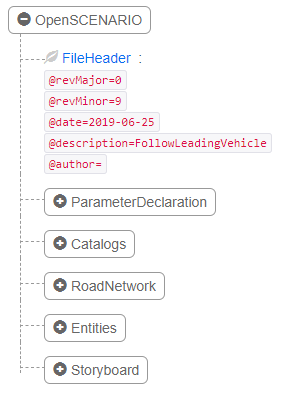

The _FileHeader_ is for informational purpose. If you design the scenario specifically to work with CARLA coordinates (left-hand Unreal coordinate system), ensure that the description starts with "CARLA:". Otherwise, the default coordinate system for OpenSCENARIO, which is a right-hand system, will be assumed (in alignment to OpenDRIVE). Besides, providing a reasonable name is recommended.

Then, there are four main components: _Catalogs_, _RoadNetwork_, _Entities_ and the _Storyboard_. In addition, parameters can be optionally declared inside the _ParameterDeclaration.

### ParameterDeclaration
Parameters can be used according to the _OSCParameterDeclaration_. Therefore, the parameter has to be provided with a name, its value and the type (integer, double or string). Important: The parameter name has to start with '$'.

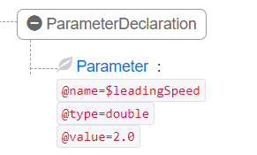

### Catalogs
Catalogs in OpenSCENARIO are a mean to import predefined information, for example about vehicle configurations. This allows, for example, to share certain setups or configurations among multiple scenarios.
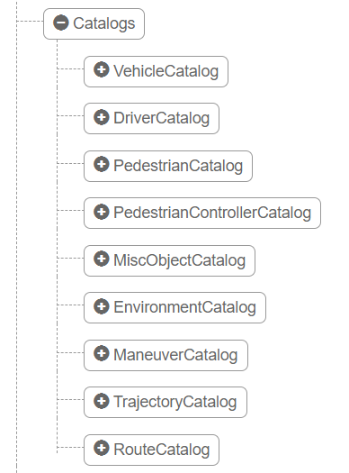

Currently only Vehicle, Pedestrian, Environment, MiscObject, and Maneuver Catalogs are supported. You must set the `CATALOG_PATH` variable at the top of the `CatalogExample.xosc` file in order for it to work. This must be an absolute path.

### RoadNetwork
The RoadNetwork points to the _Logic_ (OpenDRIVE) and _SceneGraph_ (OpenSceneGraph) files that the scenario makes use of. Currently, our implementation does not use OpenSceneGraph information, and hence this flag is not parsed. For the Logic of the RoadNetwork, either the name of the CARLA town, e.g. Town01 can be provided or the fully qualified path (e.g. /x/y/Town01.xodr).

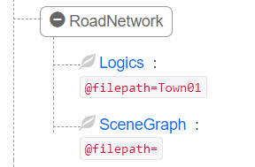

### Entities
The Entities section is used to define all traffic participants / objects relevant for the scenario. Objects can either be of type _Vehicle_ or of type _Pedestrian_ (see Images). For both, it is necessary to provide _BoundingBox_ information, to be compliant with the standard. However, this information is currently *NOT* evaluated. The same applies to the _Axles_ section for vehicles.
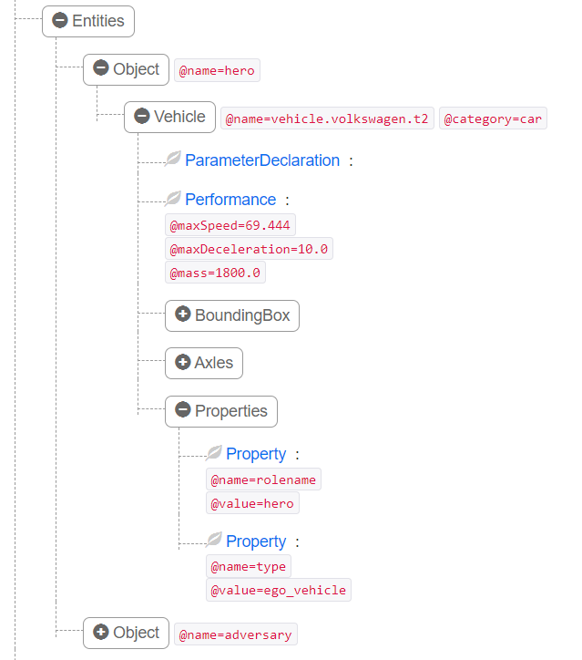 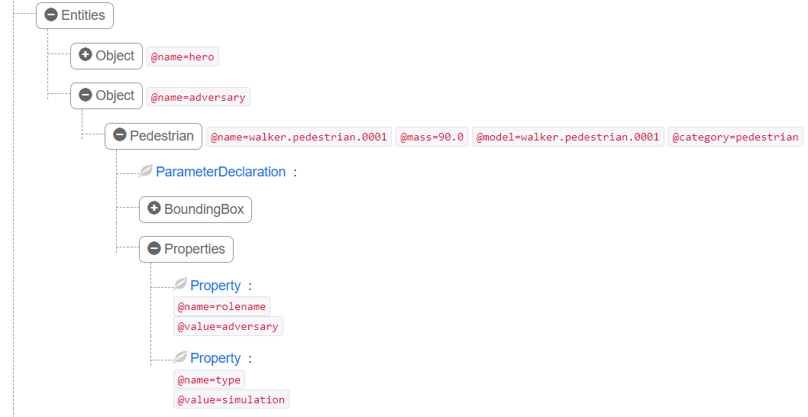

For the use with ScenarioRunner, it is important to set the Object _name_ and _Properties_. The _name_ has to be unique, and is used by CARLA to set the actor blueprint rolename. This allows for example to identify the ego vehicle by other CARLA clients, such as the ROS bridge. In addition, the _type_ property needs to be set to _ego_vehicle_, if the object is a user-controller ego vehicle, otherwise _simulation_ is a recommended value. In short:

Object name = CARLA Blueprint rolename
Property type = ego_vehicle for use-controlled vehicles, simulation otherwise

### Storyboard
The Storyboard consists of _Init_, _Story_, and _EndConditions_.

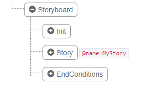

#### Init
The _Init_ of the Storyboard, as the name suggests, sets all initial states of the scenario. This is done as part of _Actions_ (Note: You can have multiple _Actions_, all are evaluated in parallel.). An _Action_ can either be _Global_ (called OSCGlobalAction in OpenSCENARIO), _Private_ (called OSCPrivateAction in OpenSCENARIO), or _UserDefined_ (called OSCUserDefinedAction in OpenSCENARIO).

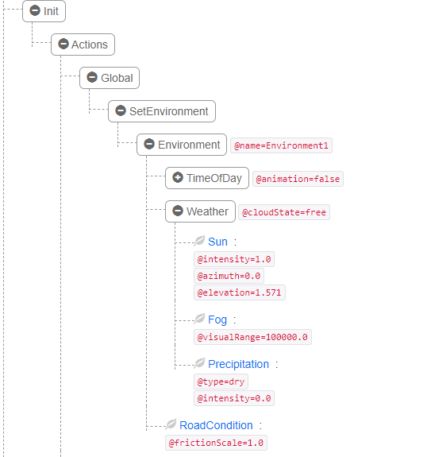

OpenSCENARIO requires certain environment settings as part of _Init_. These are performed within a _Global_ action. The TimeOfDay settings are currently not evaluated, so are the road conditions. If you like to use different weather settings, this can be done by adapting the _Weather_ action. For the allowed sun intensity, azimuth, elevation and precipitation intensity values, please refer to the CARLA documentation.

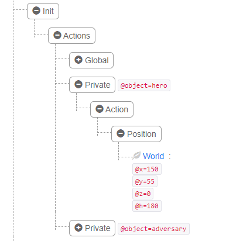

Moreover, the road friction can be adjusted using the _RoadCondition_ action. A _frictionScale_ of 0.0 means no friction at all (no vehicle traction), where a value of 1.0 represents the highest possible friction.

In addition, the object start positions are defined through _Private_ actions, as illustrated in the following image (Note: h is the yaw angle).

#### Story
The _Story_ consists of at least one _Act_, which itself consists of at least one _Sequence_ plus _Conditions_. If you want to use multiple _Act_ or _Sequence_, please note that all of these will be evaluated in _parallel_! The _Conditions_ are either used to _Start_ or _End_ a _Sequence_.

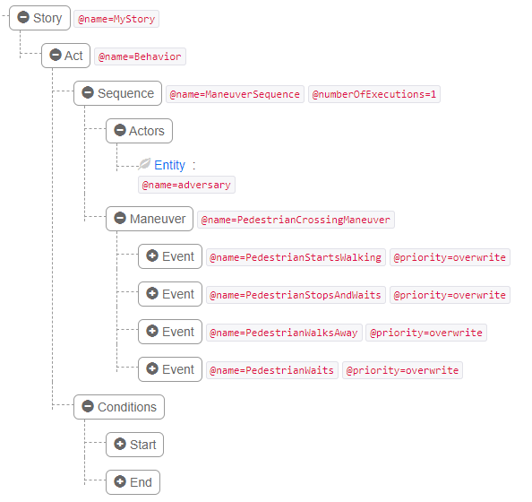

For each _Sequence_ the _Actors_ influenced by this _Sequence_ are listed, followed by the _Maneuvers_ these _Actors_ should execute. However, be aware that - despite of the name _Sequence_ all _Maneuvers_ will be again evaluated in _parallel_. Real maneuver sequences can only be achieved, by using _AfterTermination_ conditions, within the _Maneuver_ --> _Event_ --> _StartConditions_.

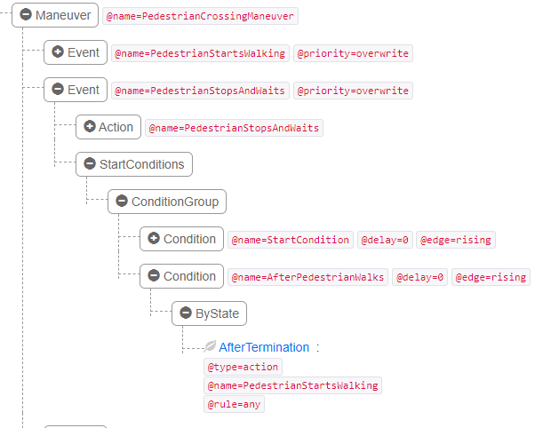

A _Maneuver_ contains at least one _Event_ (again, multiple will be evaluated in _parallel_). An _Event_ contains at least one _Action_ (if there are multiple actions, these will be evaluated in parallel) and a _StartConditions_ group that provide a list of all conditions that have to be fulfilled, before the _Action_ starts. A list of currently supported _Action_ and _Condition_ is provided [at the end of this document](Overview of available features of OpenSCENARIO v0.9).

#### EndConditions

The last part of the _Storyboard_ are the _EndConditions_. These can be either used similar to the _End_ _Conditions_ of a _Story_, or in the special case of CARLA, you can use these to get your scenario evaluated according to different criteria to pass/fail. For the latter case, the following conditions can be used:

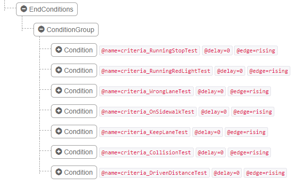

Please take a look into the provided example scenarios, for further details on these EndConditions.

## Important things to keep in mind when creating a scenario with OpenSCENARIO

- All things in OpenSCENARIO happen in parallel, this includes stories, events, actions or conditions.
- Sequences of actions or events can be created using an "AfterTermination" condition as StartCondition for the follow-up action or event
- If you design the scenario specifically to work with CARLA coordinates (left-hand Unreal coordinate system), ensure that the description in the FileHeader starts with "CARLA:". Otherwise, the default coordinate system for OpenSCENARIO, which is a right-hand system, will be assumed (in alignment to OpenDRIVE).

## Overview of available features of OpenSCENARIO v0.9:
- [ ] Catalogs
    * [x] Vehicle
    * [ ] Driver (no planned support)
    * [x] Pedestrian
    * [ ] PedestrianController (no planned support)
    * [x] MiscObject
    * [x] Environment
    * [x] Maneuver
    * [ ] Trajectory
    * [ ] Route (WIP)
- [x] Use of parameter (only global parameters are supported)
- [ ] RoadNetwork:
    * [x] Logics (OpenDrive): Specifying the OpenDrive file is supported
    * [ ] OpenSceneGraph:
    * [ ] Signals
- [x] Entities: Defining different entities is supported, with a limitation on the position definition
- [x] Positions: Can only be defined w.r.t the world frame (i.e. global coordinates)
- [ ] Controllers: Use of different (vehicle) controllers is not available
- [x] Storyboard: The Storyboard with repeated sequences is supported
- [ ] Maneuver actions:
    * [ ] Longitudinal:
       * [x] Speed
       * [ ] Distance
    * [ ] Lateral
    * [ ] Visibility
    * [ ] Meeting
    * [x] Autonomous
    * [ ] Controller
    * [x] Position
    * [ ] Routing
       * [x] FollowRoute
       * [ ] FollowTrajectory
       * [ ] AquirePosition
    * [x] Command (Support for command 'Idle')
    * [x] Script (The script file has to be fully qualified and contain the interpreter as well as arguments: Example: python /path/to/script.py --arg1)
    * [ ] SetEnvironment (Weather is supported)
    * [ ] Entity
    * [ ] Parameter
    * [ ] Traffic
    * [ ] Infrastructure
- [ ] Conditions
    * [ ] EndOfRoad
    * [x] Collision
    * [ ] Offroad
    * [ ] TimeHeadway
    * [x] TimeToCollision
    * [ ] Acceleration
    * [x] StandStill
    * [x] Speed
    * [ ] RelativeSpeed
    * [x] TraveledDistance
    * [x] ReachPosition
    * [x] Distance
    * [x] RelativeDistance
    * [x] AtStart
    * [x] AfterTermination
    * [ ] Command
    * [ ] Signal
    * [ ] Controller
    * [x] Parameter
    * [ ] TimeOfDay
    * [x] SimulationTime
