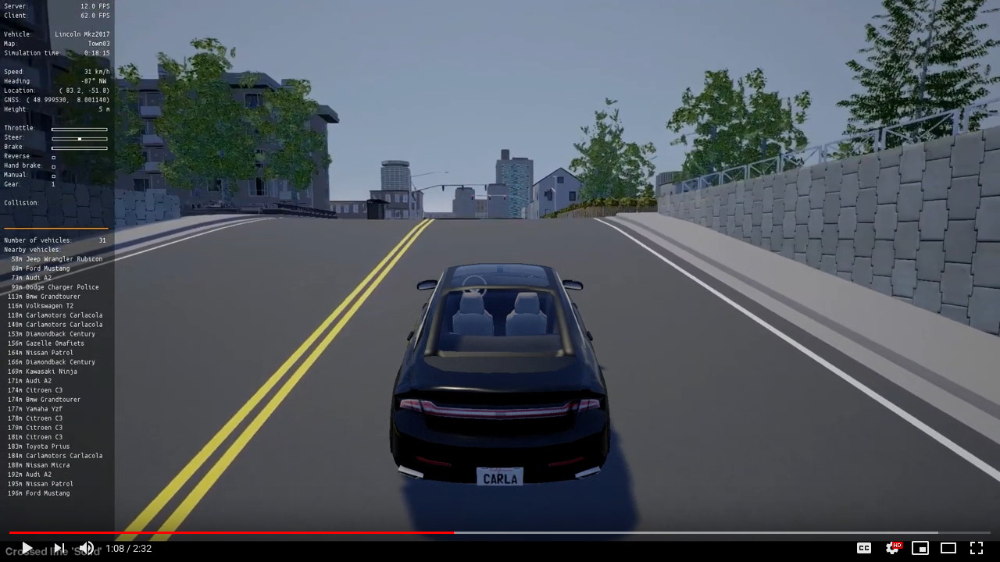

ScenarioRunner for CARLA
========================
This repository contains traffic scenario definition and an execution engine
for CARLA. It also allows the execution of a simulation of the CARLA Challenge.
You can use this system to prepare your agent for the CARLA Challenge.

Scenarios can be defined through a Python interface, and with the newest version
the scenario_runner also the upcoming [OpenScenario](http://www.openscenario.org/) standard is supported.

Building the ScenarioRunner
---------------------------

Use `git clone` or download the project from this page. Note that the master
branch contains the latest fixes and features, and may be required to use the latest features from CARLA.

Currently no build is required, as all code is in Python.

Using the ScenarioRunner
------------------------

Please take a look at our [Getting started](Docs/getting_started.md)
documentation.

Challenge Evaluation
---------------------

You can evaluate your own agents using a reproduction
of the CARLA Challenge by following [this tutorial](Docs/challenge_evaluation.md)

Contributing
------------

Please take a look at our [Contribution guidelines][contriblink].

[contriblink]: http://carla.readthedocs.io/en/latest/CONTRIBUTING

F.A.Q.
------

If you run into problems, check our
[FAQ](http://carla.readthedocs.io/en/latest/faq/).

License
-------

ScenarioRunner specific code is distributed under MIT License.
